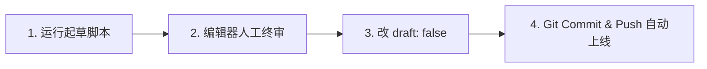

# 每日 AI 日报 · 内容生产与终审工作流

本项目贯彻 **「AI 初筛起草 + 深度人工终审」** 的生产哲学。
站点构建与起草脚本**完全解耦**：脚本未跑、或者抓取服务故障，绝不影响站点正常发布与手写发布。

---

## 1. 日常 4 步发布闭环



### 第一步：一键生成当日草稿
在终端中执行以下命令（默认生成当天的草稿文件）：
```bash
npm run draft
# 或指定特定日期
npm run draft -- --date=2026-08-29
```
脚本将在 `src/content/daily/` 下生成一份 `YYYY-MM-DD.md` 文件，且默认设置 `draft: true`。

### 第二步：人工终审（核心护城河）
在编辑器中打开刚生成的 `src/content/daily/YYYY-MM-DD.md`：
1. **刊头题记 (`epigraph`)**：定调今天的一句话，可锐利、可诗意。
2. **今日主线 (`lead`)**：用主理人的声音把今天看似分散的条目串成一条逻辑线。
3. **今日一幕 (`scene`)**：把当天最大的事件写成 30-50 字的戏剧分镜或对白。
4. **条目核验 (`items`)**：
   - 删掉平庸的条目，保留 3~5 条最具价值的内容。
   - 微调标题、确认外链（`url`）有效。
   - 校准原创点评（`note`）与读者价值（`so_what`）。

### 第三步：解除草稿标记
将 frontmatter 中的 `draft: true` 改为：
```yaml
draft: false
```

### 第四步：提交并自动部署
```bash
git add src/content/daily/YYYY-MM-DD.md
git commit -m "feat(daily): 发布 2026-08-29 日报"
git push
```
Cloudflare Pages 检测到 Git 推送后，将在 15 秒内自动全站编译上线！

---

## 2. 配置大模型 API 自动起草（可选）

如需让脚本自动调用大模型生成起草内容，只需在根目录 `.env` 中配置密钥：

```bash
# 复制模板
cp .env.example .env

# 编辑 .env 填入 OpenAI / Claude 兼容 API 密钥
AI_API_KEY=sk-xxxxxx
AI_API_BASE=https://api.openai.com/v1
AI_MODEL_NAME=gpt-4o-mini
```

配置后再次运行 `npm run draft`，脚本将自动根据 `scripts/sources.json` 监控范围，调用大模型按照「岛主声音」写作指南起草。
未配置 API Key 时，脚本自动以「离线模拟模板」模式运行，同样能产出标准格式草稿。

---

## 3. 合规性与护栏铁律

1. **永远不整段转载他人版权正文**：只保存标题 + 原创点评 + 外链来源。
2. **永远不自动发布**：起草脚本产出的永远是 `draft: true`，终审把关人必须是主理人。
3. **分类受控**：分类必须属于 `src/config/categories.ts` 中定义的 6 大分类之一。
